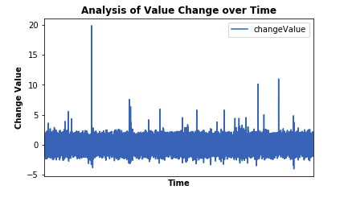
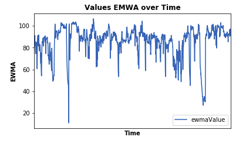
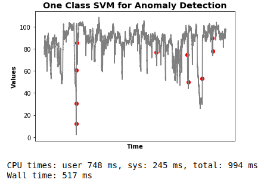
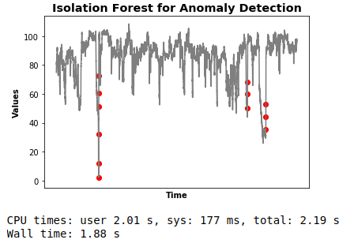

D(St)reams of Anomalies (Assignment # 06- EECS 731)
==============================

### Quick Note:
If you are interested in only looking at notebook, please access the notebook in **/notebooks/anomalyDetection.ipynb**.

/notebooks: Contains the notebook of this assignment.

/data: Contains the data csv file (machine_temperature_system_failure.csv)

### Objective:

<ul>
<li>Pick one dataset from given Anomaly Detection Benchmarks</li>
<li>Do feature engineering as a pre-process for Anomaly Detection</li>
<li>Do Anomaly Detection based modeling to detect anomalies in the given dataset</li>
</ul>

### Dataset:

I used the **Machine Temperature System Failure** dataset (https://github.com/numenta/NAB/tree/master/data) for this Anomaly Detection modeling assignment. (Data csv file is in /data/machine_temperature_system_failure.csv).

### Process:

<ul>
<li>First I did feature engineering. Please refer to notebook for more details.</li>
<li>Then, I did change in value over time graphical analysis and EMWA graphical analysis on the given dataset.</li>
<li>Finally, we trained and evaluated two anomaly detection based models separately on the given dataset to detect anomalies.</li>
</ul>

### Discussion and Results:
According to the given dataset we are using, there are **three anomalies** in it. We have to detect these anomalies using some Machine Learning Algorithm suitable for this problem. First we analyze the dataset and anomalies by making a time plot as follows:

As shown above, we can see three anomalies. The left-most anomaly is easy to detect, but next two anomalies are much closer to the normal data points. So, this makes it a challenging task for us. Next, to analyze the change in value over time for differetn data points, we plot the value change per datapoint over time as follows:

As shown in the above graph, we can now clearly see that three anomalies have the highest peaks or changes as compared to other data points. It makes it more clearer to us. Now we can focus on these anomalous data points and model algortihms for their detection. We use this information in our modeling process as detailed in the notebook. Before starting the modeling process, we also analyze the Exponentially Weighted Moving Averages (EMWA) that are helpful in smoothing the graph as follows. But we skip them being not much useful.

For modeling the Anomaly Detection problem, we trained and evaluated following two algorithms:

<ul>
<li>One Class SVM</li>
<li>Isolation Forest Model</li>
</ul>

Their training process has been given in the notebook. Once they have been modeled separately, their evaluation results for anomaly detection are given in the following two graphs:

As it can be seen from the above two graphs, One class SVM is quite efficient but not very accurate relatively, as it also labels other normal data points incorrectly as anomalous. On the other hand, Isolation Forest model is comparatively more accurate and effective, but lesser efficient with more computational time.

### Conclusion

Anomaly detection is a unique problem, as normal classification or regression based approaches are not applicable directly on this type of problem, because of the imbalanced nature of the data. In this assignment, we analyzed two anomaly detection algorithms, namely **One Class SVM** and **Isolation Forest Algorithm**. One class SVM was proved to be much faster and efficent, but Isolation Forest based model gave much effective results but slower in processing. So, we can use either of them based on the requirement (e.g Real Time processing reuiqred or not etc.). Please see /notebooks/anomalyDetection.ipynb for more details.

