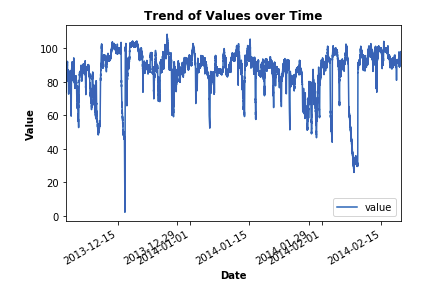

D(St)reams of Anomalies (Assignment # 06- EECS 731)
==============================

### Quick Note:
If you are interested in only looking at notebook, please access the notebook in **/notebooks/anomalyDetection.ipynb**.

/notebooks: Contains the notebook of this assignment.

/data: Contains the data csv file (machine_temperature_system_failure.csv)

### Objective:

<ul>
<li>Pick one dataset from given Anomaly Detection Benchmarks</li>
<li>Do feature engineering as a pre-process for Anomaly Detection</li>
<li>Do Anomaly Detection based modeling to detect anomalies in the given dataset</li>
</ul>

### Dataset:

I used the **Machine Temperature System Failure** dataset (https://github.com/numenta/NAB/tree/master/data) for this Anomaly Detection modeling assignment. (Data csv file is in /data/machine_temperature_system_failure.csv).

### Process:

<ul>
<li>First I did feature engineering. Please refer to notebook for more details.</li>
<li>Then, I did change in value over time graphical anlysis on the given dataset.</li>
<li>Finally, we trained and evaluated two anomaly detection based models separately on the given dataset to detect anomalies.</li>
</ul>

### Discussion and Results:
Since we have to regress scores for both teams (multi-output regression), so I used MultiOutputRegressor module of scikit-learn. Using this module, it outputs multiouput regression values using given Regression model. For this assignment, I trained and evaluated three regression models as follows:

<ul>
<li>Random Forest Regressor</li>
<li>XGBoost Regressor</li>
<li>Linear Regessor</li>
</ul>

Once above regressors were trained, we evaluted them separately on three evaluation metrics,as follows:

<ul>
<li>Mean Absolute Error (MAE)</li>
<li>Mean Squared Error (very good in telling about the variance in result values, so more desirable metric)</li>
<li>Scikit-learn Regression Score (Maximum value = 1.0) </li>
</ul>

The evaluation results for three regressors are as follows:

**Random Forest Regressor:**

MAE: **4.54832675696375**

MSE: **36.48255827784976**

Multi Target Output Random Forest Based Regressor Score: **0.701**

**XGBoost Regressor:**

MAE: 6.956283390349816

MSE: 77.05458382962796

Multi Target Output XGBoost based Regressor Score: 0.37

**Linear Regressor:**

MAE: 7.233133556966823

MSE: 82.39727180323428

Multi Target Output Linear Regressor Score: 0.326

### Conclusion

Anomaly detection is a unique problem, as normal classification or regression based approaches are not applicable directly on this type of problem, because of the imbalanced nature of the data. In this assignment, we analyzed two anomaly detection algorithms, namely **One Class SVM** and **Isolation Forest Algorithm**. One class SVM was proved to be much faster and efficent, but Isolation Forest based model gave much effective results but slower in processing. So, we can use either of them based on the requirement (e.g Real Time processing reuiqred or not etc.). Please see /notebooks/anomalyDetection.ipynb for more details.

